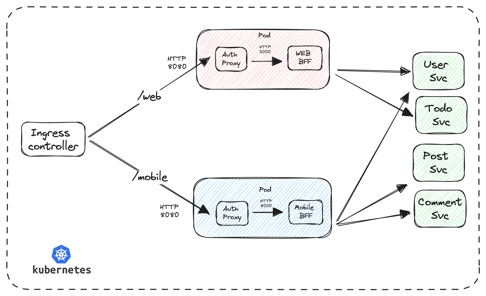

## Run with k3d (https://k3d.io)

### Create keycloak

    1. make run_keycloak
    2. Manual import File Path ./keycloak/realm.json

### Create cluster

    k3d cluster create <name_cluster> --api-port 6550 -p "8081:80@loadbalancer" --agents 2

### Deploy services

    make run_services

### Deploy bff

    make run_bff

### Map localhost:8081 to ingress

    make run_ingress

---

## Test

Download jq (https://jqlang.github.io/jq/download/)

### Authorization

    ./with_authorization.sh

### Anauthorized

    ./with_unauthorized.sh
